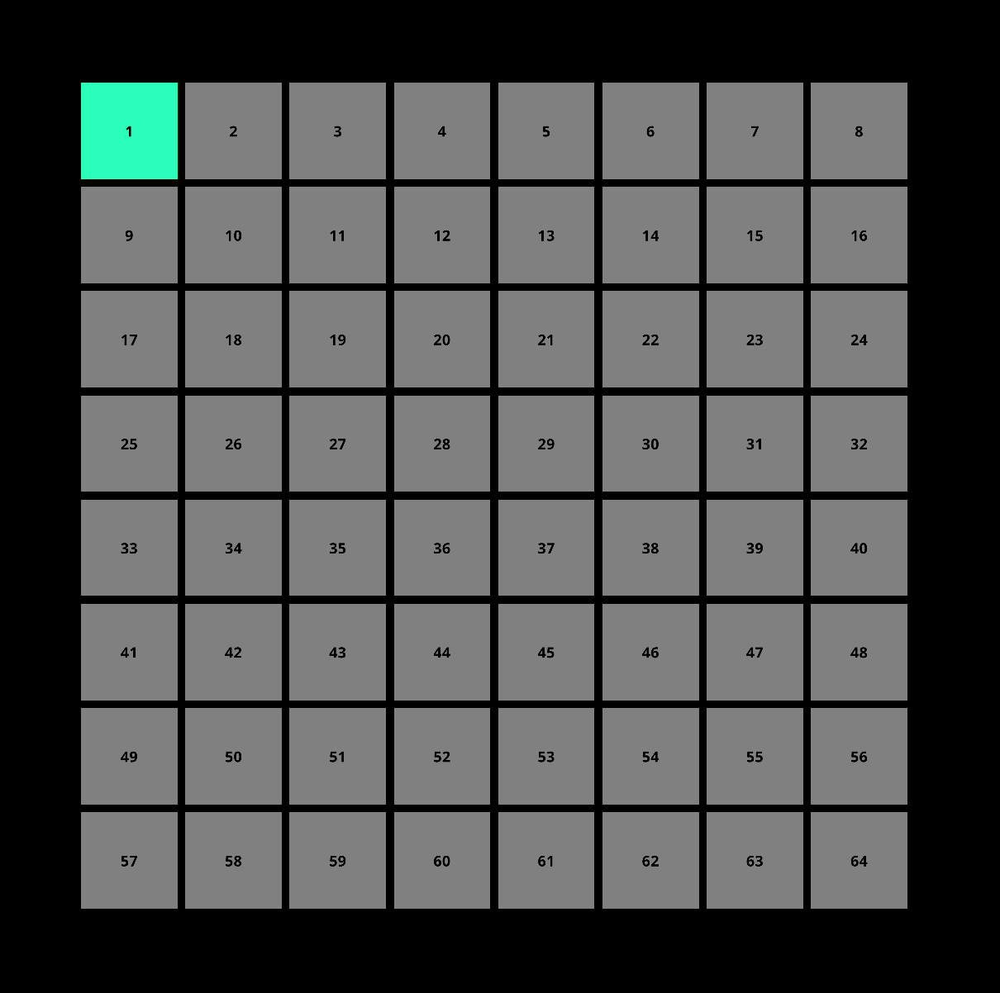
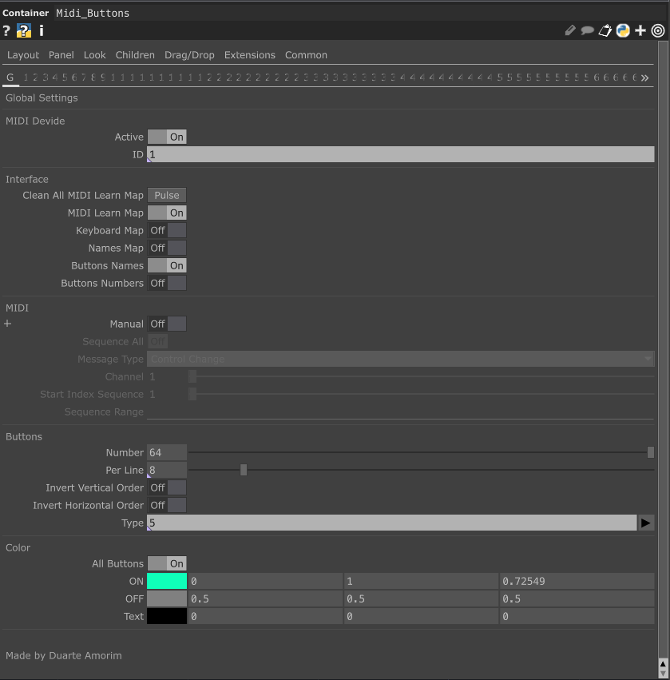
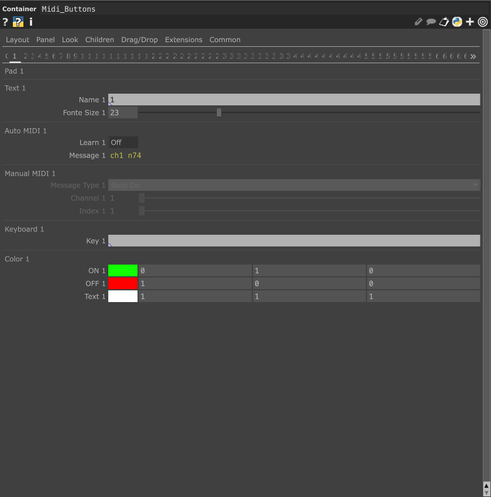

# MIDI  Learn Controller

MIDI Buttons with fast MIDI Learn to map and many other functions.

### Perform Mode Example

### Network Example

### Global Parameters Example

### Button Parameters Example

## Getting Started

1. Install TouchDesigner099
2. Open Midi_Learn_Controller/Midi_Learn_Controller.tox
3. Map the Midi_Buttons: 'Dialogs' -> 'MIDI Device Mapper.'

## Compatibility

TouchDesigner099 Build 2023.11510

